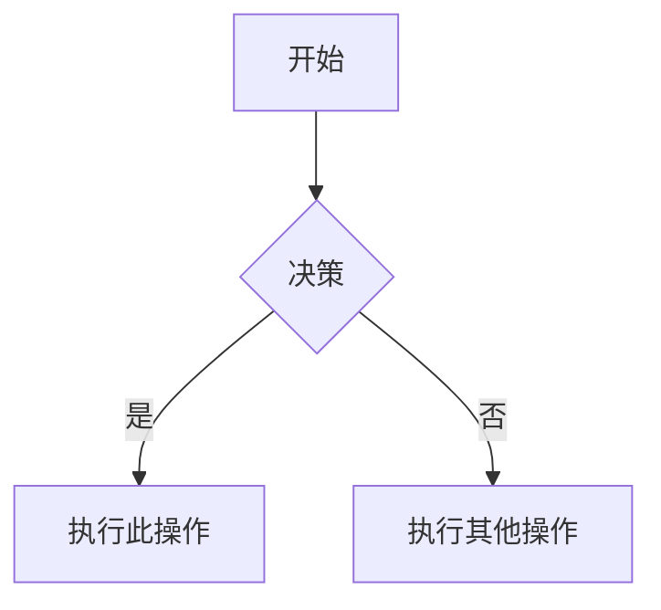

# Obsidian 风格 Markdown 技能

创建和编辑有效的 Obsidian 风格 Markdown。Obsidian 在 CommonMark 和 GFM 基础上扩展了维基链接、嵌入、标注、属性、注释和其他语法。本技能仅涵盖 Obsidian 特有的扩展——标准 Markdown（标题、粗体、斜体、列表、引用、代码块、表格）为默认已知内容。

## 工作流：创建 Obsidian 笔记

1. **添加 frontmatter**，在文件顶部设置属性（标题、标签、别名）。参见 [PROPERTIES.md](references/PROPERTIES.md) 了解所有属性类型。
2. **编写内容**，使用标准 Markdown 构建结构，加上下方的 Obsidian 特有语法。
3. **链接相关笔记**，使用维基链接（`[[笔记]]`）创建库内链接，或使用标准 Markdown 链接访问外部 URL。
4. **嵌入内容**，使用 `![[嵌入]]` 语法嵌入其他笔记、图片或 PDF 的内容。参见 [EMBEDS.md](references/EMBEDS.md) 了解所有嵌入类型。
5. **添加标注**，使用 `> [!type]` 语法高亮显示信息。参见 [CALLOUTS.md](references/CALLOUTS.md) 了解所有标注类型。
6. **验证**笔记在 Obsidian 阅读视图中正确渲染。

> 在维基链接和 Markdown 链接之间选择时：对库内的笔记使用 `[[维基链接]]`（Obsidian 会自动跟踪重命名），仅对外部 URL 使用 `[文本](url)`。

## 内部链接（维基链接）

```markdown
[[笔记名称]]                          链接到笔记
[[笔记名称|显示文本]]                  自定义显示文本
[[笔记名称#标题]]                     链接到标题
[[笔记名称#^block-id]]                链接到块
[[#同一笔记中的标题]]                  同笔记标题链接
```

通过在任意段落末尾添加 `^block-id` 来定义块 ID：

```markdown
这个段落可以被链接到。 ^my-block-id
```

对于列表和引用，将块 ID 放在块后的单独一行：

```markdown
> 一段引用

^quote-id
```

## 嵌入

在任何维基链接前添加 `!` 即可内联嵌入其内容：

```markdown
![[笔记名称]]                         嵌入完整笔记
![[笔记名称#标题]]                    嵌入章节
![[image.png]]                        嵌入图片
![[image.png|300]]                    嵌入带宽度的图片
![[document.pdf#page=3]]              嵌入 PDF 页面
```

参见 [EMBEDS.md](references/EMBEDS.md) 了解音频、视频、搜索嵌入和外部图片。

## 标注

```markdown
> [!note]
> 基本标注。

> [!warning] 自定义标题
> 带自定义标题的标注。

> [!faq]- 默认折叠
> 可折叠标注（- 折叠，+ 展开）。
```

常用类型：`note`、`tip`、`warning`、`info`、`example`、`quote`、`bug`、`danger`、`success`、`failure`、`question`、`abstract`、`todo`。

参见 [CALLOUTS.md](references/CALLOUTS.md) 了解完整列表、别名、嵌套和自定义 CSS 标注。

## 属性（Frontmatter）

```yaml
---
title: My Note
date: 2024-01-15
tags:
  - project
  - active
aliases:
  - Alternative Name
cssclasses:
  - custom-class
---
```

默认属性：`tags`（可搜索标签）、`aliases`（笔记的替代名称，用于链接建议）、`cssclasses`（用于样式的 CSS 类）。

参见 [PROPERTIES.md](references/PROPERTIES.md) 了解所有属性类型、标签语法规则和高级用法。

## 标签

```markdown
#tag                    内联标签
#nested/tag             带层级的嵌套标签
```

标签可以包含字母、数字（不能作为首字符）、下划线、连字符和正斜杠。标签也可以在 frontmatter 的 `tags` 属性中定义。

## 注释

```markdown
这是可见的 %%但这是隐藏的%% 文本。

%%
整个块在阅读视图中隐藏。
%%
```

## Obsidian 特有格式

```markdown
==高亮文本==                          高亮语法
```

## 数学公式（LaTeX）

```markdown
行内：$e^{i\pi} + 1 = 0$

块级：
$$
\frac{a}{b} = c
$$
```

## 图表（Mermaid）

````markdown

````

要将 Mermaid 节点链接到 Obsidian 笔记，添加 `class NodeName internal-link;`。

## 脚注

```markdown
带脚注的文本[^1]。

[^1]: 脚注内容。

行内脚注。^[这是行内的。]
```

## 完整示例

````markdown
---
title: Project Alpha
date: 2024-01-15
tags:
  - project
  - active
status: in-progress
---

# Project Alpha

该项目旨在使用现代技术 [[改进工作流]]。

> [!important] 关键截止日期
> 第一个里程碑的截止日期为 ==1月30日==。

## 任务

- [x] 初始规划
- [ ] 开发阶段
  - [ ] 后端实现
  - [ ] 前端设计

## 笔记

该算法使用 $O(n \log n)$ 排序。详见 [[算法笔记#排序]]。

![[架构图.png|600]]

在 [[会议记录 2024-01-10#决策]] 中已审查。
````

## 参考资料

- [Obsidian Flavored Markdown](https://help.obsidian.md/obsidian-flavored-markdown)
- [Internal links](https://help.obsidian.md/links)
- [Embed files](https://help.obsidian.md/embeds)
- [Callouts](https://help.obsidian.md/callouts)
- [Properties](https://help.obsidian.md/properties)
